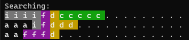

# Glitter

Haskell polyomino puzzle solver with terminal visualization. 

It works by constructing a smallest region on the board that it tried to solve completely. Only when it cannot cannot place more pieces or the region is fully solved does it increase the size of the region and continue. When the algorithm backtracks it also decreases the search region. In this way the algorithm never wastes time looking through placements that cannot have a valid solution (e.g. if there was a hole in the board that could not be filled by the remaining piece this approach will fail-fast).

## Demo

## Name

glitter - polyomino board solver

## Synopsis

glitter [-nc] < file...

## Description

Glitter places polyominos onto a board of locations and attempts to find a board solution with all polyominos placed. No polyominos can be placed overlapping with another, and no polyominos can extend outside of the board. 

A solution is still valid if there are unfilled places on the board.

## Example

This following is an exmaple of a 20x3 pentomino problem.

	20 3
	12
	5  0 0  0 1  0 2  1 0  1 1
	5  0 0  1 0  1 1  2 0  3 0
	5  0 0  1 0  2 0  3 0  4 0
	5  0 0  1 0  2 0  1 1  1 2
	5  0 0  0 1  0 2  1 0  1 2
	5  0 0  0 1  0 2  1 0  2 0
	5  0 0  1 0  1 1  1 2  2 2
	5  0 1  1 0  1 1  1 2  2 1
	5  0 0  0 1  0 2  0 3  1 0
	5  0 0  1 0  1 1  2 1  2 2
	5  0 0  1 0  2 0  2 1  3 1
	5  0 1  1 0  1 1  1 2  2 2

Example program output from the 20x3 pentomino problem:

	Found a solution!
	Looks like this: 
	e e h a a a g b b b b j d l k k k f f f 
	e h h h a a g g g b j j d l l l k k i f 
	e e h c c c c c g j j d d d l i i i i f 
	Goodbye.

The file can be entered manually using the following syntax:

	[WIDTH] [HEIGHT] ⏎
	[NUMBER OF POLYOMINOS] ⏎
	[NUMBER OF COORDINATES] [COORD 1] [COORD 2] ... [COORD N] ⏎ ## first polyomino
	⋮
	[NUMBER OF COORDINATES] [COORD 1] [COORD 2] ... [COORD N] ⏎ ## last polyomino
After pressing the last enter the program should execute immediatly.

Alternatively the problem can be passed inside a file using file redirection:

	glitter < file

## Options

	-nc     : disable ANSI colour output
	-nl     : disable polyomino labels

## Build

	ghc Main
